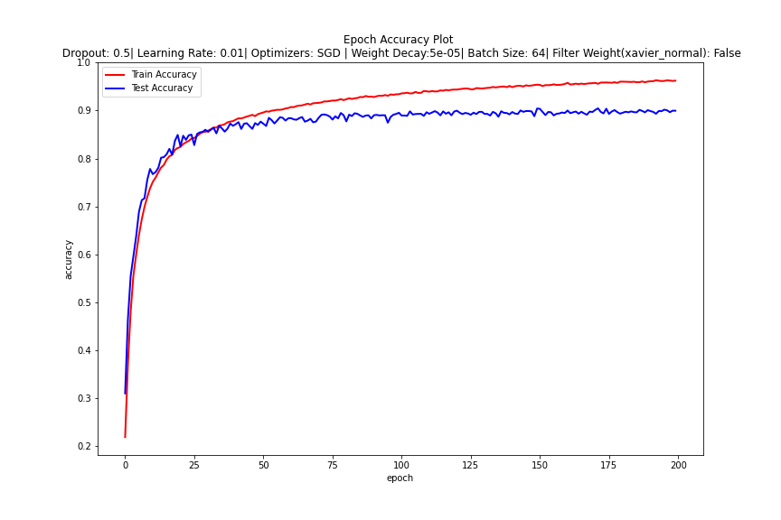

# CNN based CIFAR-10 Image Classifier

This repository contains two different CNN image classifiers trained using two different architectures. The first model is trained on the All-CNN architecture, which achieves 90% accuracy using the Keras framework. The second model is trained on the LeNet-5 architecture, which achieves 74% accuracy using PyTorch.

## All-CNN YGNet Architecture Using Keras

This model is motivated by the "Striving for Simplicity - All Convolution Net" paper. The paper achieves 95.6% accuracy using the All-CNN architecture. My model (YGNet) has a few changes in the architecture compared to the All-CNN architecture used in the paper. I've used max-pooling instead of making it a fully convolutional network. The total number of trainable parameters remains the same, i.e., ~1.3M. The changes in my architecture were made on purpose to understand the effect and importance of certain layers in the convolutional neural network.

### Directory: `YGNet_Keras_Model`

### Steps to Build

The source code allows training the model from scratch. Also, the pre-trained model is present in this repo which generates 90% accuracy. The steps to build the source code are as follows:

```bash
$ git clone git@https://github.com/Alokbpandey/project_airdale.git
$ cd YGNet_Keras_Model
$ python3 CIFAR-10_CNN.py train
```

This will train the model from scratch. The hyper-parameters can be tweaked as required. To load the pre-trained model:

```bash
$ cd YGNet_Keras_Model
$ python3 CIFAR-10_CNN.py load
```

### Performance Curves 

The accuracy-epoch performance curve after running for 200 epochs 



The loss-epoch performance curve after running for 200 epochs

 

## LeNet-5 Architecture Using PyTorch

LeNet-5 is a basic architecture that performs moderately well on the CIFAR-10 dataset. LeNet-5 has around ~395k learnable parameters. My model achieved 74% accuracy using PyTorch. This model is trained on Google Colab.
